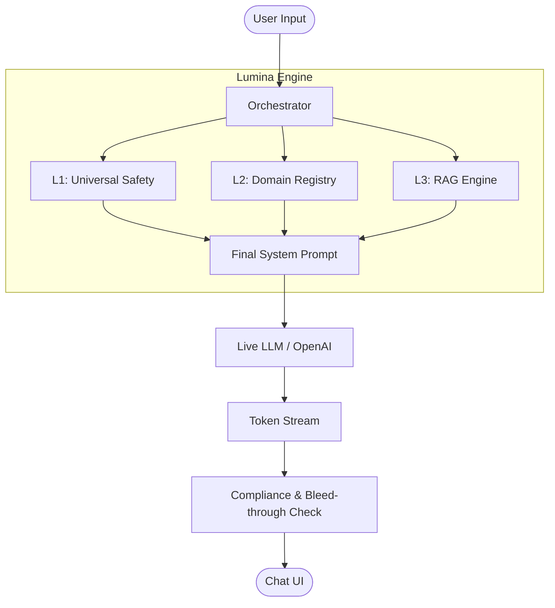

# 🌕 Lumina Engine: Technical Documentation

## 1. Executive Summary
Lumina is an automated, context-aware engagement and compliance engine designed to broker communications between Large Language Models (LLMs) and specialized business domains. It ensures that AI responses remain safe, domain-isolated, and contextually grounded using a unique tripartite orchestration architecture.

## 2. System Architecture

### 2.1 The Tripartite Prompt Stack (L1, L2, L3)
Lumina uses a layered approach to prompt engineering to ensure safety and persona consistency:

*   **Layer 1 (L1) - Universal Safety & Identity**: Hardened system instructions that define the AI's core identity and strict security protocols (e.g., anti-jailbreak, persona loyalty).
*   **Layer 2 (L2) - Domain Persona**: Contextual rules, tone parameters, and few-shot examples specific to a domain (e.g., `fishing.com`, `legal-advisor`).
*   **Layer 3 (L3) - RAG Context**: Real-time knowledge injected from the `RAGEngine` to ground responses in factual data.

## 3. Core Components

### 3.1 Guardrail Engine
The **Guardrail Engine** is a deterministic validator that scans LLM outputs for:
*   **Safety Violations**: Hate speech, violence, self-harm.
*   **Restricted Topics**: Legal advice, medical prescriptions, financial hacking.
*   **Policy Compliance**: Advertisement policy and copyright protection.

### 3.2 Bleed-Through Detection
The **Bleed-Through Evaluator** prevents cross-domain contamination. If a response configured for "Domain A" contains specific lexicon or knowledge strictly belonging to "Domain B", the engine intercepts and logs a bleed event.

### 3.3 RAG Engine
The **RAG (Retrieval-Augmented Generation) Engine** automatically fetches relevant handbook data or knowledge segments based on the user's intent, ensuring the AI has access to the most up-to-date domain information.

## 4. Engineering Operations

### 4.1 Observability
Lumina is instrumented with **Prometheus** metrics to track:
*   `lumina_requests_total`: Throughput per domain.
*   `lumina_request_latency_seconds`: Response time distributions.
*   `lumina_guardrail_violations_total`: Security event counters.
*   `lumina_bleed_events_total`: Domain isolation tracking.

### 4.2 Security Hardening
*   **PII Redactor**: Automatically scrubs emails, US phone numbers, and potential credit card numbers before they reach the LLM.
*   **Self-Correction Loop**: If a response is rejected by guardrails, the engine re-attempts generation with corrective feedback (max 2 retries).
*   **Audit Trail**: Every request is logged with its full prompt stack into `/backend/logs/audit/` as structured JSONL.

## 5. API Reference
| Endpoint | Method | Description |
| :--- | :--- | :--- |
| `/api/v1/orchestrate/` | `POST` | Primary AI engagement endpoint (Supports Streaming). |
| `/api/v1/domains/` | `GET` | Lists all active domain personas. |
| `/api/v1/domains/{name}` | `PUT` | Updates domain configuration dynamically. |
| `/metrics` | `GET` | Prometheus scraping endpoint. |

## 6. FAQ (Frequently Asked Questions)

**Q: How does Lumina handle multiple languages?**
A: Lumina's orchestration layer is language-agnostic. However, the `GuardrailEngine` and `BleedThroughEvaluator` use keyword-based matching. To support a new language, simply add the relevant keywords to the lexicons in `guardrail.py` and `evaluator.py`.

**Q: Can I use a different LLM provider?**
A: Yes. The system is designed to use the OpenAI-compatible standard. You can switch to local providers (like Ollama or vLLM) by changing the `OPENAI_API_BASE` and `LLM_MODEL` in your `.env`.

**Q: What happens if the RAG engine fails?**
A: Lumina includes a fallback mechanism. If RAG retrieval fails, the engine still processes the request using L1 and L2 layers, though accuracy for domain-specific technical facts may decrease.

## 7. Known Issues
- **Lexicon Limitations**: The keyword-based bleed-through detection can have false positives if domains share common technical terms.
- **Model Latency**: While Lumina overhead is <2ms, the total time depends on the LLM provider's performance.

## 8. TODO / Future Enhancements
- [ ] **Vector Database Integration**: Replace the mock keyword RAG with a production-ready Vector DB (Pinecone, Weaviate, or Supabase pgvector).
- [ ] **Dynamic Lexicon Learning**: Automatically update bleed-through lexicons based on successful audit trails.
- [ ] **Admin Dashboard**: Create a dedicated UI to view Prometheus metrics and audit logs in real-time.
- [ ] **Role-Based Access Control (RBAC)**: Implement authentication for the `/domains` management endpoints.

--
*Last Updated: February 2026*
