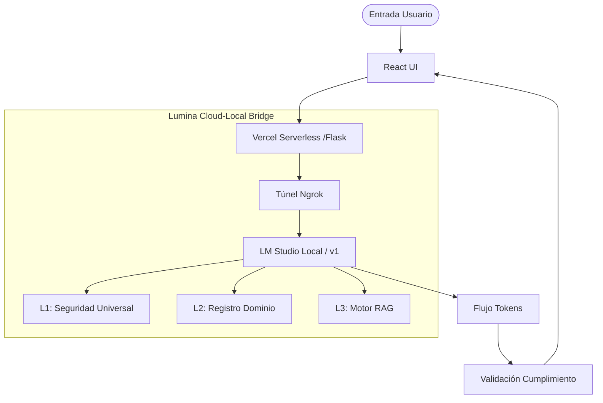

# 🌕 Lumina Engine: Documentación Técnica

## 1. Resumen Ejecutivo
Lumina es un motor de cumplimiento y compromiso automatizado y consciente del contexto, diseñado para actuar como intermediario entre los Modelos de Lenguaje Extensos (LLMs) y los dominios comerciales especializados. Garantiza que las respuestas de la IA sigan siendo seguras, aisladas por dominio y basadas en el contexto utilizando una arquitectura de orquestación tripartita única.

## 2. Arquitectura del Sistema

### 2.1 La Pila de Prompts Tripartita (L1, L2, L3)
Lumina utiliza un enfoque por capas para la ingeniería de prompts con el fin de garantizar la seguridad y la consistencia de la personalidad:

*   **Capa 1 (L1) - Seguridad Universal e Identidad**: Instrucciones de sistema endurecidas que definen la identidad central de la IA y protocolos de seguridad estrictos (ej. anti-jailbreak, lealtad a la personalidad).
*   **Capa 2 (L2) - Personalidad del Dominio**: Reglas contextuales, parámetros de tono y ejemplos de "few-shot" específicos de un dominio (ej. `fishing.com`, `asesor-legal`).
*   **Capa 3 (L3) - Contexto RAG**: Conocimiento en tiempo real inyectado desde el `RAGEngine` para basar las respuestas en datos factuales.

## 3. Capa de Orquestación Híbrida
Lumina 0.4.0 introduce un **Puente Híbrido Nube-Local**. Esto permite que el frontend de React de alto rendimiento y la API de Flask vivan en **Vercel**, mientras que los LLMs pesados se ejecutan en **hardware local** (vía LM Studio).

*   **Seguridad**: ngrok proporciona un túnel seguro con cabeceras `ngrok-skip-browser-warning`.
*   **Resiliencia**: El backend maneja un tiempo de espera de 60 segundos.
*   **Portabilidad**: El sistema puede cambiarse a la nube completa actualizando la variable `LM_STUDIO_URL`.

## 3. Componentes Principales

### 3.1 Motor de Guardrails (Guardrail Engine)
El **Motor de Guardrails** es un validador determinista que escanea las salidas del LLM en busca de:
*   **Violaciones de Seguridad**: Discurso de odio, violencia, autolesiones.
*   **Temas Restringidos**: Asesoramiento legal, recetas médicas, piratería financiera.
*   **Cumplimiento de Políticas**: Política publicitaria y protección de derechos de autor.

### 3.2 Detección de Filtración (Bleed-Through Detection)
El **Evaluador de Filtración** evita la contaminación cruzada entre dominios. Si una respuesta configurada para el "Dominio A" contiene léxico o conocimientos específicos que pertenecen estrictamente al "Dominio B", el motor intercepta y registra un evento de filtración.

### 3.3 Motor RAG (RAG Engine)
El **Motor RAG (Generación Aumentada por Recuperación)** recupera automáticamente datos de manuales o segmentos de conocimiento relevantes según la intención del usuario, asegurando que la IA tenga acceso a la información de dominio más actualizada.

## 4. Operaciones de Ingeniería

### 4.1 Observabilidad
Lumina está instrumentado con métricas de **Prometheus** para rastrear:
*   `lumina_requests_total`: Rendimiento por dominio.
*   `lumina_request_latency_seconds`: Distribución de tiempos de respuesta.
*   `lumina_guardrail_violations_total`: Contadores de eventos de seguridad.
*   `lumina_bleed_events_total`: Seguimiento de aislamiento de dominios.

### 4.2 Fortalecimiento de Seguridad
*   **Redactor de PII**: Elimina automáticamente correos electrónicos, números de teléfono de EE. UU. y posibles números de tarjeta de crédito antes de que lleguen al LLM.
*   **Bucle de Autocorrección**: Si una respuesta es rechazada por los guardrails, el motor vuelve a intentar la generación con retroalimentación correctiva (máximo 2 reintentos).
*   **Pista de Auditoría (Audit Trail)**: Cada solicitud se registra con su pila completa de prompts en `/backend/logs/audit/` como JSONL estructurado.

## 5. Referencia de la API
| Punto de Enlace | Método | Descripción |
| :--- | :--- | :--- |
| `/api/v1/orchestrate/` | `POST` | Punto de entrada principal para la IA (Soporta Streaming). |
| `/api/v1/domains/` | `GET` | Lista todas las personalidades de dominio activas. |
| `/api/v1/domains/{name}` | `PUT` | Actualiza la configuración del dominio dinámicamente. |
| `/metrics` | `GET` | Punto de enlace para recolección de Prometheus. |

## 6. FAQ (Preguntas Frecuentes)

**P: ¿Cómo maneja Lumina múltiples idiomas?**
R: La capa de orquestación de Lumina es independiente del idioma. Sin embargo, el `GuardrailEngine` y el `BleedThroughEvaluator` utilizan coincidencias basadas en palabras clave. Para admitir un nuevo idioma, simplemente añada las palabras clave relevantes a los léxicos en `guardrail.py` y `evaluator.py`.

**P: ¿Puedo usar un proveedor de LLM diferente?**
R: Sí. El sistema está diseñado para utilizar el estándar compatible con OpenAI. Puede cambiar a proveedores locales (como Ollama o vLLM) modificando el `OPENAI_API_BASE` y `LLM_MODEL` en su archivo `.env`.

**P: ¿Qué sucede si el motor RAG falla?**
R: Lumina incluye un mecanismo de respaldo. Si la recuperación de RAG falla, el motor sigue procesando la solicitud utilizando las capas L1 y L2, aunque la precisión de los hechos técnicos específicos del dominio puede disminuir.

## 7. Problemas Conocidos
- **Limitaciones del Léxico**: La detección de filtración basada en palabras clave puede tener falsos positivos si los dominios comparten términos técnicos comunes.
- **Latencia del Modelo**: Aunque el recargo de Lumina es <2ms, el tiempo total depende del rendimiento del proveedor de LLM.

## 8. TODO / Mejoras Futuras
- [ ] **Integración con Bases de Datos Vectoriales**: Reemplazar el RAG de palabras clave simulado con una base de datos vectorial lista para producción (Pinecone, Weaviate o Supabase pgvector).
- [ ] **Aprendizaje Dinámico de Léxico**: Actualizar automáticamente los léxicos de filtración basados en pistas de auditoría exitosas.
- [ ] **Tablero de Administración**: Crear una interfaz dedicada para ver las métricas de Prometheus y los registros de auditoría en tiempo real.
- [ ] **Control de Acceso Basado en Roles (RBAC)**: Implementar autenticación para los puntos de enlace de gestión de `/domains`.

--
*Última actualización: Febrero 2026*
