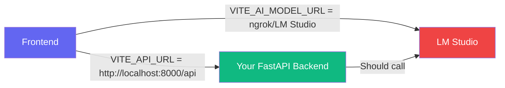
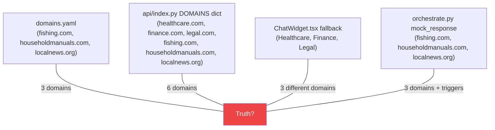
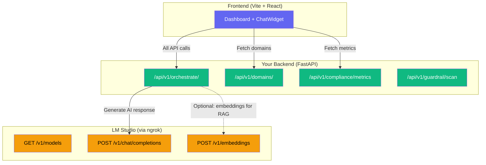

# 🔍 Lumina Engine — Full Codebase Audit Report

> **Date:** 2026-02-26  
> **Scope:** Frontend (`frontend/`), Backend (`backend/`), Vercel Serverless (`api/`), Configuration  
> **Goal:** Identify all issues preventing a live recruiter demo and provide a fix plan

---

## Executive Summary

The Lumina Engine has a solid **architectural vision** — 3-layer prompt orchestration, deterministic guardrails, bleed-through detection, and a streaming chat widget. However, the current implementation has **5 critical problem areas** that make the live demo non-functional:

| # | Problem | Severity | Impact |
|---|---------|----------|--------|
| 1 | **Endpoint Architecture Mismatch** | 🔴 Critical | Frontend hits wrong URLs → LM Studio errors |
| 2 | **Hardcoded Strings / Magic Values** | 🟠 High | Brittle code, impossible to maintain |
| 3 | **Mock Data Everywhere** | 🟠 High | Dashboard shows fake numbers, not real AI |
| 4 | **Dead Code & Config Drift** | 🟡 Medium | 3 separate endpoint implementations diverge |
| 5 | **Missing LM Studio Integration** | 🔴 Critical | No actual AI responses in prod |

---

## Problem 1: Endpoint Architecture Mismatch 🔴

### The Root Cause of the LM Studio Errors

The errors you're seeing:
```
Unexpected endpoint or method. (OPTIONS /compliance/metrics). Returning 200 anyway
Unexpected endpoint or method. (OPTIONS /domains/). Returning 200 anyway
```

**are caused by the frontend sending requests to your LM Studio ngrok URL instead of to your own backend.**

### How the Request Flow is Currently Broken



**What SHOULD happen:**
1. Frontend → calls **your FastAPI backend** with `/api/v1/domains/`, `/api/v1/compliance/metrics`, `/api/v1/orchestrate/`
2. FastAPI backend → calls **LM Studio** at `/v1/chat/completions`

**What IS happening:**
- The frontend [api.ts](file:///d:/Development/Dialogue%20Labs%20Development/Lumina%20Automated%20Context-Aware%20Engagement%20&%20Compliance%20Engine/frontend/src/services/api.ts) creates an axios client with `baseURL = VITE_API_URL` which is `http://localhost:8000/api`
- But `VITE_API_URL` has **no `/v1` prefix**, so the frontend hits `/api/compliance/metrics` instead of `/api/v1/compliance/metrics` → **404**
- In production (Vercel), the [vercel.json](file:///d:/Development/Dialogue%20Labs%20Development/Lumina%20Automated%20Context-Aware%20Engagement%20&%20Compliance%20Engine/vercel.json) env sets `VITE_API_URL=/api` (also missing `/v1`)
- The `VITE_AI_MODEL_URL` (LM Studio) is defined but **never properly used** — it's declared in [orchestrateStream](file:///d:/Development/Dialogue%20Labs%20Development/Lumina%20Automated%20Context-Aware%20Engagement%20&%20Compliance%20Engine/frontend/src/services/api.ts#33-71) but never sent requests to

### Detailed Issues

| File | Line | Issue |
|------|------|-------|
| [api.ts](file:///d:/Development/Dialogue%20Labs%20Development/Lumina%20Automated%20Context-Aware%20Engagement%20%26%20Compliance%20Engine/frontend/src/services/api.ts#L4) | 4 | `baseURL` uses `VITE_API_URL` = `http://localhost:8000/api` — **missing `/v1`** |
| [api.ts](file:///d:/Development/Dialogue%20Labs%20Development/Lumina%20Automated%20Context-Aware%20Engagement%20%26%20Compliance%20Engine/frontend/src/services/api.ts#L34-L35) | 34-35 | `AI_MODEL_URL` declared but **never used** in any request |
| [api.ts](file:///d:/Development/Dialogue%20Labs%20Development/Lumina%20Automated%20Context-Aware%20Engagement%20%26%20Compliance%20Engine/frontend/src/services/api.ts#L76) | 76 | Hits `/compliance/metrics` → should be `/v1/compliance/metrics` |
| [api.ts](file:///d:/Development/Dialogue%20Labs%20Development/Lumina%20Automated%20Context-Aware%20Engagement%20%26%20Compliance%20Engine/frontend/src/services/api.ts#L80) | 80 | Hits `/domains/` → should be `/v1/domains/` |
| [.env](file:///d:/Development/Dialogue%20Labs%20Development/Lumina%20Automated%20Context-Aware%20Engagement%20%26%20Compliance%20Engine/frontend/.env#L1) | 1 | `VITE_API_URL=http://localhost:8000/api` → missing `/v1` |
| [vercel.json](file:///d:/Development/Dialogue%20Labs%20Development/Lumina%20Automated%20Context-Aware%20Engagement%20%26%20Compliance%20Engine/vercel.json#L40) | 40 | `VITE_API_URL=/api` → missing `/v1` |

### The LM Studio Endpoints (for reference)

These are the **only valid LM Studio endpoints** — they are OpenAI-compatible:

| Method | Endpoint | Purpose |
|--------|----------|---------|
| `GET` | `/v1/models` | List available models |
| `POST` | `/v1/chat/completions` | Chat completion (main) |
| `POST` | `/v1/completions` | Text completion |
| `POST` | `/v1/embeddings` | Embeddings |
| `POST` | `/v1/responses` | Responses API |

> [!CAUTION]
> Endpoints like `/compliance/metrics`, `/domains/`, `/orchestrate/` are **Lumina's own backend routes**. They must NEVER be sent to LM Studio.

---

## Problem 2: Hardcoded Strings / Magic Values 🟠

The codebase is full of inline string literals with no centralization.

### Frontend — Scattered Strings

| File | Line | Hardcoded String | Should Be |
|------|------|-----------------|-----------|
| [api.ts](file:///d:/Development/Dialogue%20Labs%20Development/Lumina%20Automated%20Context-Aware%20Engagement%20%26%20Compliance%20Engine/frontend/src/services/api.ts#L4) | 4 | `'http://localhost:8000/api/v1'` | Config constant |
| [api.ts](file:///d:/Development/Dialogue%20Labs%20Development/Lumina%20Automated%20Context-Aware%20Engagement%20%26%20Compliance%20Engine/frontend/src/services/api.ts#L34) | 34 | `'http://localhost:8000/api'` | Same config |
| [api.ts](file:///d:/Development/Dialogue%20Labs%20Development/Lumina%20Automated%20Context-Aware%20Engagement%20%26%20Compliance%20Engine/frontend/src/services/api.ts#L35) | 35 | `'http://localhost:8000/api/v1'` | Same config |
| [ChatWidget.tsx](file:///d:/Development/Dialogue%20Labs%20Development/Lumina%20Automated%20Context-Aware%20Engagement%20%26%20Compliance%20Engine/frontend/src/components/ChatWidget.tsx#L15) | 15 | `'fishing.com'` | Dynamic from config |
| [Dashboard.tsx](file:///d:/Development/Dialogue%20Labs%20Development/Lumina%20Automated%20Context-Aware%20Engagement%20%26%20Compliance%20Engine/frontend/src/Dashboard.tsx#L74) | 74 | `'/api/v1/logs'` | Config constant |
| [Dashboard.tsx](file:///d:/Development/Dialogue%20Labs%20Development/Lumina%20Automated%20Context-Aware%20Engagement%20%26%20Compliance%20Engine/frontend/src/Dashboard.tsx#L81) | 81 | `alert('New Campaign...')` | Proper placeholder/modal |
| [Dashboard.tsx](file:///d:/Development/Dialogue%20Labs%20Development/Lumina%20Automated%20Context-Aware%20Engagement%20%26%20Compliance%20Engine/frontend/src/Dashboard.tsx#L197-L214) | 197-214 | **Entire violations list is hardcoded inline** | Should come from API |
| [Dashboard.tsx](file:///d:/Development/Dialogue%20Labs%20Development/Lumina%20Automated%20Context-Aware%20Engagement%20%26%20Compliance%20Engine/frontend/src/Dashboard.tsx#L102) | 102 | `'0.2% from last hour'` | Should be computed |

### Backend — Duplicated Domain Data

| File | Line | Issue |
|------|------|-------|
| [api/index.py](file:///d:/Development/Dialogue%20Labs%20Development/Lumina%20Automated%20Context-Aware%20Engagement%20%26%20Compliance%20Engine/api/index.py#L13-L44) | 13-44 | **DOMAINS dict duplicated** — different from [domains.yaml](file:///d:/Development/Dialogue%20Labs%20Development/Lumina%20Automated%20Context-Aware%20Engagement%20&%20Compliance%20Engine/backend/app/templates/domains.yaml) |
| [api/index.py](file:///d:/Development/Dialogue%20Labs%20Development/Lumina%20Automated%20Context-Aware%20Engagement%20%26%20Compliance%20Engine/api/index.py#L115) | 115 | `"model": "your-model-name"` — **placeholder never updated** |
| [api/index.py](file:///d:/Development/Dialogue%20Labs%20Development/Lumina%20Automated%20Context-Aware%20Engagement%20%26%20Compliance%20Engine/api/index.py#L170-L182) | 170-182 | **6 separate hardcoded mock responses** as inline strings |
| [orchestrate.py](file:///d:/Development/Dialogue%20Labs%20Development/Lumina%20Automated%20Context-Aware%20Engagement%20%26%20Compliance%20Engine/backend/app/api/v1/endpoints/orchestrate.py#L31-L50) | 31-50 | [get_mock_response()](file:///d:/Development/Dialogue%20Labs%20Development/Lumina%20Automated%20Context-Aware%20Engagement%20&%20Compliance%20Engine/backend/app/api/v1/endpoints/orchestrate.py#26-51) has hardcoded trigger strings |
| [ChatWidget.tsx](file:///d:/Development/Dialogue%20Labs%20Development/Lumina%20Automated%20Context-Aware%20Engagement%20%26%20Compliance%20Engine/frontend/src/components/ChatWidget.tsx#L36-L51) | 36-51 | **Fallback domains** differ from backend's [domains.yaml](file:///d:/Development/Dialogue%20Labs%20Development/Lumina%20Automated%20Context-Aware%20Engagement%20&%20Compliance%20Engine/backend/app/templates/domains.yaml) |
| [config.py](file:///d:/Development/Dialogue%20Labs%20Development/Lumina%20Automated%20Context-Aware%20Engagement%20%26%20Compliance%20Engine/backend/app/core/config.py#L22) | 22 | `LLM_MODEL: str = "gpt-4o"` — should be LM Studio model |

### Domain Data Inconsistency Map

There are **4 separate definitions** of domains, all diverging:



> [!WARNING]
> The domain names don't even match — [domains.yaml](file:///d:/Development/Dialogue%20Labs%20Development/Lumina%20Automated%20Context-Aware%20Engagement%20&%20Compliance%20Engine/backend/app/templates/domains.yaml) uses `fishing.com` but ChatWidget fallback uses `Healthcare` (capitalized, no TLD).

---

## Problem 3: Mock Data Masquerading as Real Data 🟠

The dashboard shows **static mock data** — even the "live" indicators are fake.

### Mock Data Inventory

| Location | What's Mocked | Impact |
|----------|---------------|--------|
| [compliance.py](file:///d:/Development/Dialogue%20Labs%20Development/Lumina%20Automated%20Context-Aware%20Engagement%20%26%20Compliance%20Engine/backend/app/api/v1/endpoints/compliance.py#L13-L22) | `total_requests: 1420`, `compliance_pass_rate: "97.18%"` | Dashboard stats are permanent fakes |
| [api/index.py](file:///d:/Development/Dialogue%20Labs%20Development/Lumina%20Automated%20Context-Aware%20Engagement%20%26%20Compliance%20Engine/api/index.py#L87-L96) | Different compliance mock: `compliance_rate: 99.7`, `total_requests: 2847` | Vercel shows *different* fake numbers! |
| [rag.py](file:///d:/Development/Dialogue%20Labs%20Development/Lumina%20Automated%20Context-Aware%20Engagement%20%26%20Compliance%20Engine/backend/app/core/rag.py#L18-L34) | `MOCK_KNOWLEDGE` dict with 9 hardcoded entries | RAG never does real retrieval |
| [Dashboard.tsx](file:///d:/Development/Dialogue%20Labs%20Development/Lumina%20Automated%20Context-Aware%20Engagement%20%26%20Compliance%20Engine/frontend/src/Dashboard.tsx#L102) | `"0.2% from last hour"` | Change indicator is hardcoded |
| [Dashboard.tsx](file:///d:/Development/Dialogue%20Labs%20Development/Lumina%20Automated%20Context-Aware%20Engagement%20%26%20Compliance%20Engine/frontend/src/Dashboard.tsx#L197-L214) | Recent Violations list | 4 hardcoded violation entries |
| [ChatWidget.tsx](file:///d:/Development/Dialogue%20Labs%20Development/Lumina%20Automated%20Context-Aware%20Engagement%20%26%20Compliance%20Engine/frontend/src/components/ChatWidget.tsx#L278) | `"Lumina Engine v1.0 • Phase 2 Optimized"` | Version string is hardcoded |

> [!IMPORTANT]
> For a recruiter demo, the dashboard MUST show real data flowing from LM Studio through your pipeline. Static numbers make the project look unfinished.

---

## Problem 4: Dead Code & Configuration Drift 🟡

### 3 Separate Backend Implementations

The project has **three different "backends"** that don't share any code:

| Implementation | File | Used When |
|---------------|------|-----------|
| FastAPI Backend | `backend/app/` | Local dev (`uvicorn`) |
| Vercel Serverless | `api/index.py` | Production (Vercel) |
| Frontend Fallbacks | `ChatWidget.tsx` | When API calls fail |

Each one has its own domain definitions, mock responses, and metric shapes. **They will never behave the same way.**

### Unused Variables & Dead Code

| File | Location | Issue |
|------|----------|-------|
| [api.ts](file:///d:/Development/Dialogue%20Labs%20Development/Lumina%20Automated%20Context-Aware%20Engagement%20%26%20Compliance%20Engine/frontend/src/services/api.ts#L35) | Line 35 | `AI_MODEL_URL` declared, never used |
| [api/index.py](file:///d:/Development/Dialogue%20Labs%20Development/Lumina%20Automated%20Context-Aware%20Engagement%20%26%20Compliance%20Engine/api/index.py#L115) | Line 115 | `"model": "your-model-name"` — placeholder |
| [vercel.json](file:///d:/Development/Dialogue%20Labs%20Development/Lumina%20Automated%20Context-Aware%20Engagement%20%26%20Compliance%20Engine/vercel.json#L45) | Line 45 | `LM_STUDIO_API_KEY: "your-api-key-here"` — placeholder |
| [config.py](file:///d:/Development/Dialogue%20Labs%20Development/Lumina%20Automated%20Context-Aware%20Engagement%20%26%20Compliance%20Engine/backend/app/core/config.py#L20-L27) | 20-27 | `DATABASE_URL`, `SUPABASE_URL`, `SUPABASE_KEY` — never used |
| [.env.production](file:///d:/Development/Dialogue%20Labs%20Development/Lumina%20Automated%20Context-Aware%20Engagement%20%26%20Compliance%20Engine/frontend/.env.production) | All | `VITE_API_URL=https://your-lumina-app.vercel.app/api` — placeholder |
| Backend `.env` | Line 6-8 | `OPENAI_API_KEY`, `LLM_MODEL` commented out — never configured for LM Studio |

### Config That Should Exist But Doesn't

- **No `LM_STUDIO_URL` in backend `.env`** — The backend doesn't know where LM Studio lives
- **No `LM_STUDIO_MODEL` anywhere in backend** — It defaults to `gpt-4o` which won't work with LM Studio
- **No central config for API endpoint paths** — each file invents its own

---

## Problem 5: Missing LM Studio Integration 🔴

The backend `orchestrate.py` uses the `openai` Python SDK with `settings.OPENAI_API_KEY`. Since there's no API key set, it **always falls through to mock responses**.

### What Needs to Happen

LM Studio exposes an OpenAI-compatible API. The fix is straightforward:

```diff
# backend/.env
- # OPENAI_API_KEY="sk-..."
- # LLM_MODEL="gpt-4o"
+ LM_STUDIO_URL=https://lashanda-nontelegraphical-ozella.ngrok-free.dev/v1
+ LM_STUDIO_API_KEY=lm-studio
+ LLM_MODEL=your-actual-loaded-model-name
```

```diff
# backend/app/core/config.py
+ LM_STUDIO_URL: str = "https://lashanda-nontelegraphical-ozella.ngrok-free.dev/v1"
+ LM_STUDIO_API_KEY: str = "lm-studio"

# backend/app/api/v1/endpoints/orchestrate.py
- openai_client = AsyncOpenAI(api_key=settings.OPENAI_API_KEY) if settings.OPENAI_API_KEY else None
+ openai_client = AsyncOpenAI(
+     api_key=settings.LM_STUDIO_API_KEY,
+     base_url=settings.LM_STUDIO_URL
+ ) if settings.LM_STUDIO_URL else None
```

---

## 🛠️ Fix Plan (Priority Order)

### Phase 1: Fix the Plumbing (30 min) — CRITICAL

| # | Task | File(s) |
|---|------|---------|
| 1.1 | Fix `VITE_API_URL` to include `/v1` | `frontend/.env`, `vercel.json` |
| 1.2 | Fix `api.ts` baseURL and remove duplicate fallback URLs | `frontend/src/services/api.ts` |
| 1.3 | Add `LM_STUDIO_URL` + `LM_STUDIO_API_KEY` to backend config | `backend/.env`, `backend/app/core/config.py` |
| 1.4 | Wire `AsyncOpenAI` to LM Studio via config | `backend/app/api/v1/endpoints/orchestrate.py` |
| 1.5 | Query `/v1/models` from LM Studio to auto-detect model name | New utility or config enhancement |

### Phase 2: Centralize Constants & Kill Duplicates (45 min)

| # | Task | File(s) |
|---|------|---------|
| 2.1 | Create a shared `constants.ts` for all frontend URLs/strings | New: `frontend/src/config/constants.ts` |
| 2.2 | Replace all hardcoded strings with constants | `Dashboard.tsx`, `ChatWidget.tsx`, `api.ts` |
| 2.3 | Delete fallback domain definitions from ChatWidget | `ChatWidget.tsx` |
| 2.4 | Unify domain definitions — single source of truth in `domains.yaml` | `api/index.py`, `ChatWidget.tsx` |
| 2.5 | Fix `api/index.py` to use LM Studio model from env, not `"your-model-name"` | `api/index.py` |

### Phase 3: Make Dashboard Real (1 hr)

| # | Task | File(s) |
|---|------|---------|
| 3.1 | Replace compliance mock with real Prometheus counter reads | `compliance.py` |
| 3.2 | Match compliance response shape between FastAPI and Vercel | `compliance.py`, `api/index.py` |
| 3.3 | Add a `/api/v1/compliance/violations` endpoint for recent events | New endpoint |
| 3.4 | Dashboard should fetch violations from API, not hardcode them | `Dashboard.tsx` |
| 3.5 | Wire `MetricsChart` to show real-time data via polling or SSE | `MetricsChart.tsx` |

### Phase 4: Clean Up & Polish (30 min)

| # | Task | File(s) |
|---|------|---------|
| 4.1 | Remove dead variables (`AI_MODEL_URL`, unused settings) | Various |
| 4.2 | Add proper TypeScript types (replace all `any`) | `Dashboard.tsx`, `ChatWidget.tsx` |
| 4.3 | Update `.env.production` with real Vercel URL | `frontend/.env.production` |
| 4.4 | Remove `alert()` calls and placeholder strings | `Dashboard.tsx` |

---

## Quick Reference: Correct Architecture



> [!TIP]
> The frontend should **NEVER** talk to LM Studio directly. All requests go through your FastAPI backend which acts as the orchestration layer, guardrail enforcer, and compliance auditor.

---

## Ready to Fix?

I recommend starting with **Phase 1** immediately — it's the critical path to get AI responses flowing. Want me to begin implementing the fixes?
